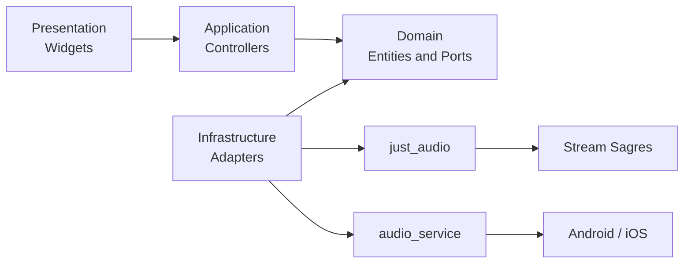
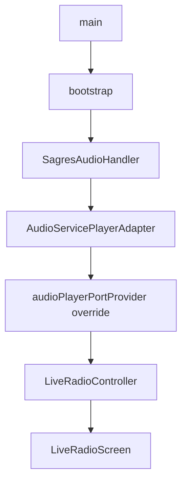

# Arquitetura

## Estilo adotado

A POC usa organização **feature-first** com separação hexagonal dentro das
funcionalidades relevantes. O objetivo é manter as regras independentes de UI,
rede e plugins, sem introduzir complexidade desnecessária para uma validação.



> [!important] Regra de dependência
> As dependências apontam para o domínio. O domínio não conhece Riverpod,
> widgets, ExoPlayer, AVPlayer, `just_audio` ou `audio_service`.

## Estrutura

```text
lib/
├── app/
│   ├── bootstrap.dart
│   ├── sagres_app.dart
│   └── theme/
├── core/
│   └── errors/
└── features/
    ├── live_radio/
    │   ├── domain/
    │   ├── application/
    │   ├── infrastructure/
    │   └── presentation/
    ├── schedule/
    │   ├── domain/
    │   ├── infrastructure/
    │   └── presentation/
    ├── news/
    │   ├── domain/
    │   ├── infrastructure/
    │   └── presentation/
    ├── profile/presentation/
    └── shell/presentation/
```

## Camadas e responsabilidades

### App

| Componente | Responsabilidade |
|---|---|
| `main.dart` | Inicializar binding e chamar bootstrap |
| `bootstrap.dart` | Inicializar `AudioService`, criar adapter e montar providers |
| `SagresApp` | Configurar `MaterialApp`, tema e shell |
| `SagresTheme` | Centralizar tokens visuais da marca |

### Domínio

Contém conceitos estáveis e contratos:

- `LiveStation`: identidade e URL de uma estação;
- `PlaybackStatus`: estados possíveis do player;
- `PlaybackSnapshot`: estado e mensagem opcional;
- `AudioPlayerPort`: operações esperadas de qualquer player;
- `RadioProgram`: horário, título e apresentador/origem;
- `ScheduleRepository`: contrato da grade;
- `NewsArticle`: modelo simplificado de notícia.

### Aplicação

`LiveRadioController` coordena a intenção do usuário e o player:

- assina o stream de estados do adapter;
- bloqueia play duplicado;
- publica loading antes da conexão;
- converte exceções em estado de falha;
- decide entre play e pause no `toggle`.

O estado é exposto com Riverpod por `NotifierProvider`.

### Infraestrutura

`SagresAudioHandler` encapsula `just_audio` e integra `audio_service`. Ele:

- configura a sessão de áudio;
- carrega a URL apenas quando necessário;
- traduz `PlayerState` em `PlaybackSnapshot`;
- publica `PlaybackState` para o sistema operacional;
- expõe play, pause e stop para notificação e tela bloqueada.

`AudioServicePlayerAdapter` adapta o handler para `AudioPlayerPort`.

`InMemoryScheduleRepository` e `InMemoryNewsRepository` fornecem dados
demonstrativos. Eles são pontos de troca para futuros adapters HTTP.

### Apresentação

- `AppShell`: mantém as quatro abas com `IndexedStack`;
- `LiveRadioScreen`: player, capa, animações e próximos programas;
- `ScheduleScreen`: filtro visual por dia e grade;
- `NewsScreen`: cards demonstrativos;
- `ProfileScreen`: protótipo de área do ouvinte.

## Composição e injeção



Em testes, o mesmo provider recebe `FakeAudioPlayer`. Isso elimina dependência
de rede, codec e APIs nativas.

## Integrações nativas

### Android

- permissão de internet;
- wake lock;
- foreground service para mídia;
- `AudioService` e `MediaButtonReceiver` no manifest;
- `MainActivity` baseada em `AudioServiceActivity`.

### iOS

- `UIBackgroundModes` com `audio` no `Info.plist`;
- projeto Runner preparado para inicialização Flutter.

## Fluxo de dependências

| Origem | Pode depender de | Não deve depender de |
|---|---|---|
| Presentation | Application, Domain, Flutter | Implementação concreta do player |
| Application | Domain, Riverpod | `just_audio`, Android/iOS |
| Domain | Dart | Flutter, plugins, rede |
| Infrastructure | Domain, plugins | Widgets de tela |

---

Anterior: [[01-Visao-Geral-e-Requisitos]] · Próximo:
[[03-Modelo-de-Dominio]] · Diagramas: [[04-Diagramas-UML]]
