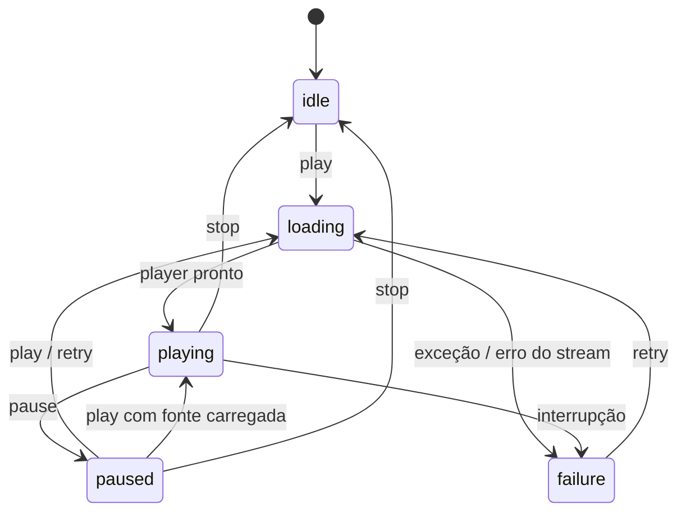

# Modelo de domínio

## Estação

`LiveStation` representa uma fonte de transmissão:

| Campo | Tipo | Uso |
|---|---|---|
| `name` | `String` | Nome da emissora |
| `frequency` | `String` | Identificação AM 730 |
| `streamUrl` | `Uri` | Endereço do áudio |
| `tagline` | `String` | Identidade editorial |

A fábrica estática `LiveStation.sagres` configura a única estação da POC.

## Estado de reprodução



| Estado | Significado na UI |
|---|---|
| `idle` | Pronto para iniciar |
| `loading` | Conectando ou armazenando buffer |
| `playing` | Áudio ativo e animações executando |
| `paused` | Fonte carregada, áudio e animações parados |
| `failure` | Falha exibida com opção de retry |

## Porta de saída do player

```dart
abstract interface class AudioPlayerPort {
  Stream<PlaybackSnapshot> get playback;
  Future<void> play(LiveStation station);
  Future<void> pause();
  Future<void> stop();
  Future<void> dispose();
}
```

A porta descreve o que a aplicação precisa. Ela não descreve como Android,
iOS, ExoPlayer ou AVPlayer realizam a reprodução.

## Programação

`RadioProgram` possui início, título e responsável/origem. O horário formatado
é derivado de `Duration`. `ScheduleRepository` oferece:

- `programsFor(DateTime date)`;
- `currentProgram(DateTime instant)`.

O adapter atual percorre a grade ordenada e escolhe o último programa cujo
horário de início seja menor ou igual ao instante informado.

## Falhas

`PlaybackFailure` contém uma mensagem segura para apresentação e, opcionalmente,
a causa técnica. O controller evita expor diretamente exceções de plugin ao
usuário.

> [!note] Limite da POC
> Não há taxonomia detalhada para offline, DNS, timeout, TLS e codec. Todos são
> traduzidos para falha de reprodução. Uma versão de produto pode adotar códigos
> e políticas de retry diferentes.

## Estado visual e estado técnico

As animações não mantêm um estado paralelo. Elas recebem `isPlaying`, derivado
de `PlaybackStatus.playing`:

- `true`: controllers de ondas, equalizador e glow repetem;
- `false`: controllers param e retornam ao frame inicial.

Essa relação impede que a UI pareça estar transmitindo quando o áudio está
pausado ou falhou.

---

Anterior: [[02-Arquitetura]] · Próximo: [[04-Diagramas-UML]]
