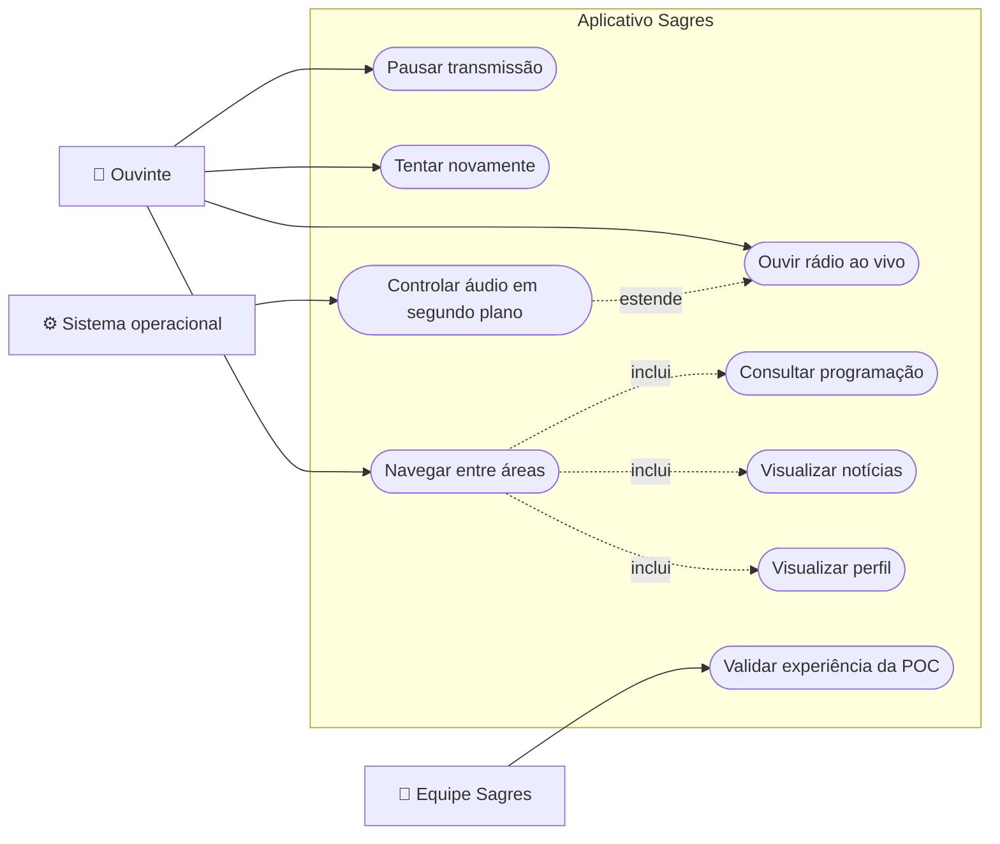
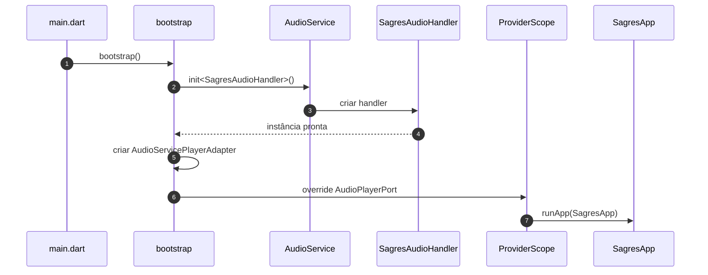
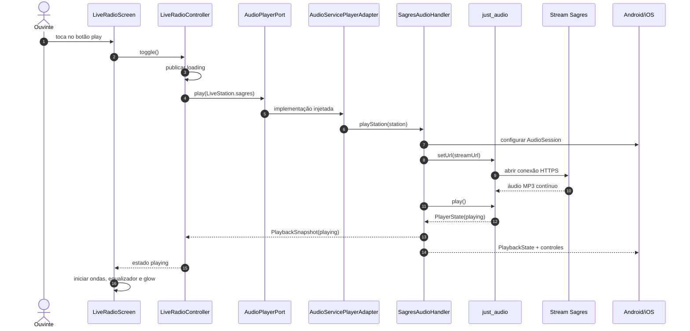
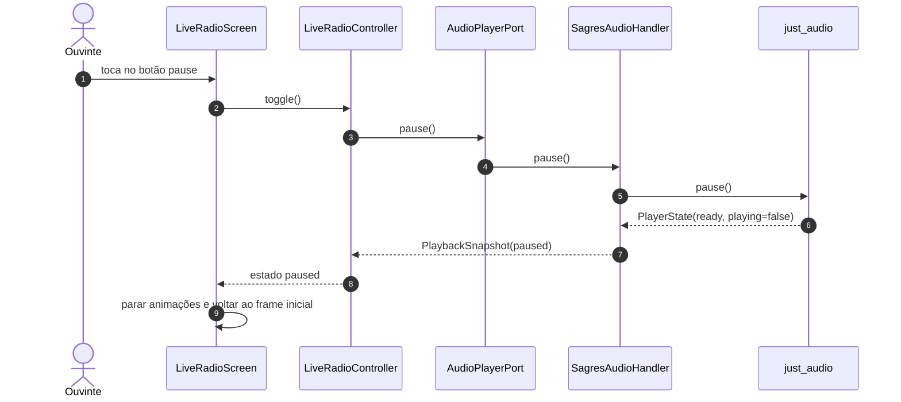
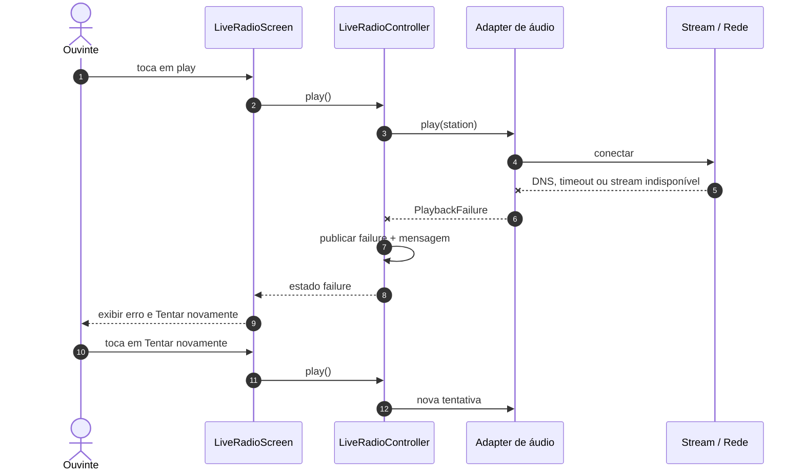
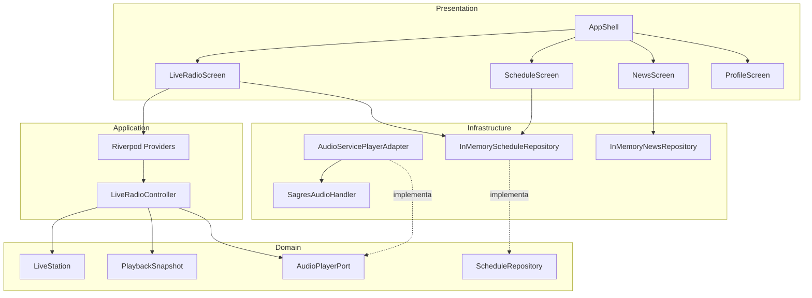
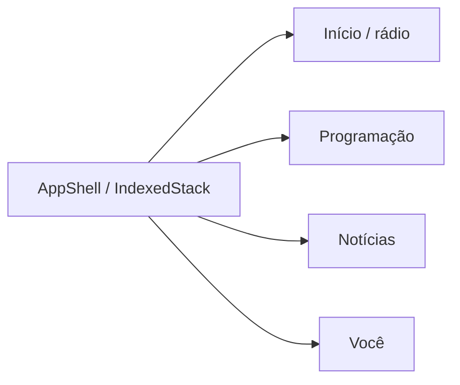

# Diagramas UML e fluxos

> [!tip] Obsidian
> Os diagramas abaixo usam Mermaid nativo. Abra a nota em modo de leitura para
> renderizá-los.

## Diagrama de casos de uso

O Mermaid não possui uma notação UML de casos de uso nativa; o fluxo abaixo usa
atores e elipses equivalentes, mantendo renderização sem plugins no Obsidian.

## Sequência de inicialização

## Sequência de reprodução bem-sucedida

## Sequência de pausa

## Sequência de falha e retry

## Diagrama de componentes

## Navegação

---

Anterior: [[03-Modelo-de-Dominio]] · Próximo: [[05-Testes-e-Qualidade]]
