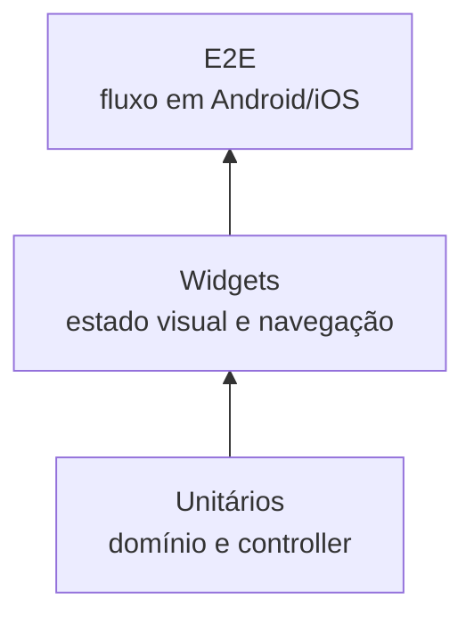

# Testes e qualidade

## Estratégia

A pirâmide de testes separa regras rápidas de integrações dependentes de
dispositivo:



## Testes unitários

### `live_radio_controller_test.dart`

- inicia a estação oficial;
- ignora play duplicado durante loading;
- reflete estados emitidos pelo adapter;
- converte `PlaybackFailure` em estado apresentável;
- pausa quando toggle é acionado durante playing.

### `in_memory_schedule_repository_test.dart`

- encontra o programa correspondente ao horário;
- retorna nulo antes do início da grade;
- protege a coleção contra mutação.

## Testes de widgets

`app_shell_test.dart` verifica:

- conteúdo inicial e botão do player;
- chamada ao player fake;
- transição para playing;
- ondas, equalizador e glow animados em playing;
- retorno desses elementos ao estado estático em pause;
- mensagem e botão de retry em failure;
- navegação entre as quatro áreas.

## Teste E2E

`integration_test/app_flow_test.dart` percorre o fluxo crítico com um adapter
determinístico:

1. abrir o aplicativo;
2. iniciar reprodução;
3. confirmar estado visual de playing;
4. pausar;
5. navegar por Programação, Notícias e Você.

> [!warning] Escopo do E2E
> O E2E evita depender do servidor real para não tornar a suíte instável. A
> conectividade do stream deve ser validada separadamente por smoke test.

## Matriz de rastreabilidade

| Requisito | Teste principal |
|---|---|
| RF-02 iniciar transmissão | controller + widget + E2E |
| RF-03 pausar | controller + widget + E2E |
| RF-04 representar estados | controller + widget |
| RF-05 retry | controller + widget |
| RF-08 animações condicionais | widget |
| RF-09 navegação | widget + E2E |
| RF-13 programa atual | repository |
| RNF-01 domínio independente | estrutura e análise estática |
| RNF-03 testar sem rede | `FakeAudioPlayer` |

## Comandos

```bash
flutter analyze
flutter test
flutter test --coverage
flutter test integration_test/app_flow_test.dart -d emulator-5554
```

## Critérios para evolução

Antes de trocar adapters em memória por APIs:

- adicionar testes de contrato HTTP;
- separar falhas de conectividade e conteúdo inválido;
- definir timeout e retry com backoff;
- cobrir cache e modo offline quando aplicável;
- executar E2E em Android e iOS reais.

---

Anterior: [[04-Diagramas-UML]] · Próximo: [[06-Execucao-e-Operacao]]
